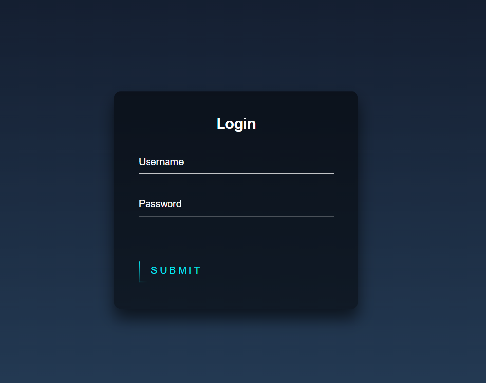

# LogIn-Page-
An animated login page, built using HTML and CSS, uses stylish transitions and engaging animations to make the login experience more visually appealing and user-friendly. These animations could involve interactive elements like buttons, form fields, or background effects, enhancing the overall login process and making it more inviting for users.

# Sample 

